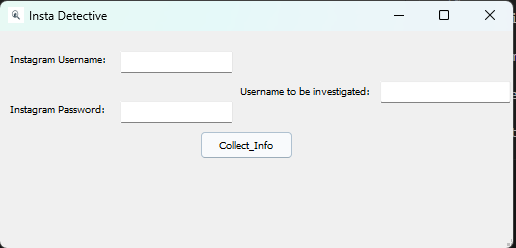

## Packet installation

firt in first create your environment in system: 
> python -m venv env

mac, windows ,linux environments have diffrent commands:
>__linux__ : source env/bin/activate
>__windows__ : env/Script/activate

this python command provides you independent environment to use packeges.After that we will install required packeges with pip packege maneger.

> pip install -r requrirement.txt

from now on everything is ready to use...

type in commend line: 

>python InstaDetective.py

# Critical information

To use this application 2FA needs to be disabled.

you can see the process from your terminal.

at the end of the process you will take an massage that includes: 

__Collecting info is successful... you can see the info in the folder__

